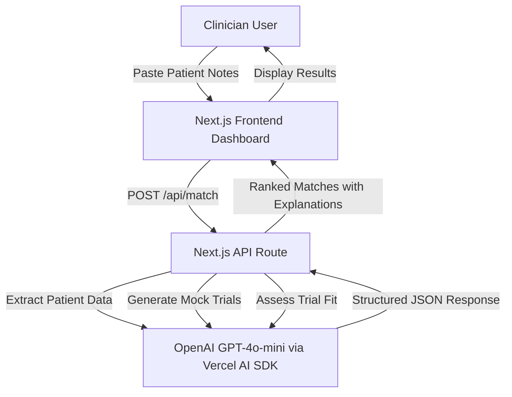

# MatchEngine Oncology

## Overview
This project is a prototype for Hackathon 01, an AI-powered web app that helps clinicians quickly match patients to clinical trials using free-text profiles. Built using AI coding agents (Kiro), it demonstrates AI nativeness through NLP for input parsing and explainable matching. The app is web-based and uses Next.js 14 with the Vercel AI SDK.

## Problem Statement
Clinical trial matching is slow, opaque, and inefficient:
- Patients miss opportunities due to lack of awareness and complex criteria.
- Clinicians lack tools to scan trials during consultations, relying on manual reviews.
- Trials face 80% enrollment delays, costing billions in recruitment.

Focused problem: Enable clinicians to input real-world patient profiles (messy free-text) and get transparent, explainable trial fits to discuss with patients. This targets the clinician bottleneck, where providers influence most enrollments but waste time on jargon-heavy criteria.

## Existing Solutions
- **Tempus**: AI pre-screening from EMRs, oncology-focused; provider-oriented but not ad-hoc for free-text.
- **BEKhealth**: Matches from EMRs, identifies 10x more patients; strong for sites but privacy-heavy and not clinician-conversation ready.
- **TrialX**: NLP matching for patients; form-based, lacks explainability for clinicians.
- **Antidote.me**: Questionnaire-driven; patient-facing, static, no messy text handling.
- **Inspirata Trial Navigator**: Automates with NLP/EHR; efficient but not transparent or clinician-centric.

Gaps: Most are form/EMR-based, lack explainable AI for free-text, and don't empower clinicians for real-time use.

## Our Solution
### Primary User
Clinicians (e.g., oncologists) during patient consultations.

### Specific Problem Solved
Clinicians input free-text patient profiles; AI provides instant trial matches with explanations, speeding up referrals and reducing opacity.

### Key Features
- **Free-Text Input**: Parse messy clinical notes into structured patient profiles
- **AI-Powered Matching**: Three-stage AI pipeline using OpenAI GPT-4o-mini:
  1. Extract patient data (age, condition, stage, biomarkers, treatments)
  2. Generate realistic mock trials for demo scenarios
  3. Assess trial fit with explainable reasoning and conservative scoring
- **Ranked Results**: Trials sorted by match score (0-100) with color coding
- **Explainable Outputs**: Plain-English explanations for every match/exclusion
- **Demo Scope**: Focused on breast cancer with synthetic trials for reliability

### Why Our Solution is Great and Differentiated
- **Novelty**: Explainable AI for free-text—beyond black-box tools; clinician-focused for systemic impact.
- **Problem Research**: Addresses 80% delay stat by targeting referrals; gaps in clinician tools per industry reports.
- **UX & Empathy**: Intuitive interface understands clinician workflows (e.g., "Scan in 30s").
- **Technical Execution**: Meaningful AI/ML; uses mock data for demo reliability.
- **Communication**: Justified scope (oncology/US) for high-volume impact.

### Success Looks Like
- Quick matches (<30s) with 80%+ accuracy on mocks.
- Demo: End-to-end flow for a synthetic patient.

### Future Features (Post-Hackathon)
- EHR integration (e.g., Epic) for auto-input.
- Real-time trial alerts via PubMed.
- Sponsor dashboard for recruitment analytics.
- Patient self-service mode.
- Advanced ML: Train on enrollment data for predictive matching.

## System Architecture


## AI Validation & Safety

To ensure reliable outputs, we validate all AI-generated data before displaying results to clinicians:

### Patient Profile Validation
- **Age**: Must be 18-120 years (flags unrealistic values)
- **Cancer Stage**: Must be I, II, III, or IV (with sub-stages like IIIA, IVB)
- **ECOG Score**: Must be 0-5 (performance status validation)
- **Biomarker Contradictions**: Catches impossible combinations (e.g., TNBC cannot be HER2+, ER+, or PR+)
- **Missing Critical Data**: Warns when stage or biomarkers are absent for cancer patients

### Mock Trial Validation
- **Trial Count**: Always returns exactly 3 trials (perfect match, excluded, uncertain)
- **NCT ID Format**: Validates NCT + 8 digits format
- **Required Fields**: Ensures title, phase, summary, and criteria are present
- **Match Score Range**: Validates 0-100 score and alignment with matchType
- **Criteria Completeness**: Requires minimum 3 inclusion and 2 exclusion criteria

### Edge Cases Handled
- **Format Issues**: Normalizes stage format ("stage III" → "Stage III"), ECOG notation
- **Impossible Combinations**: Flags Stage 0 metastatic disease, contradictory biomarkers
- **Missing Data**: Provides warnings when critical fields are absent
- **Out-of-Range Values**: Clamps ages, scores to valid ranges
- **Malformed AI Output**: Falls back to hardcoded demo trials if validation fails

### Current Limitations
- **Mock Data Only**: No real ClinicalTrials.gov API integration (demo reliability)
- **Breast Cancer Focus**: Optimized for HER2+/ER+/PR+ biomarkers only
- **US Trials Only**: No international trial support
- **No EHR Integration**: Manual free-text input required
- **Single Disease**: Not validated for non-oncology conditions
- **Conservative Scoring**: May under-match to prioritize patient safety

### Future Improvements
- Real-time trial database sync with ClinicalTrials.gov API
- Multi-disease support with disease-specific validation rules
- EHR integration for automatic patient data extraction
- Machine learning model trained on actual enrollment outcomes
- Clinician feedback loop to improve match accuracy
- Support for rare biomarkers and complex eligibility criteria

## Current Status

✅ **Complete:**
- AI prompt engineering (extract, generate, assess)
- API route (`/api/match`) with full matching pipeline
- Type definitions and error handling
- Mock trial data for demo scenarios
- AI design documentation
- Validation layer for AI outputs (patient profiles, mock trials)
- Polished UI components (InputScreen, ResultsScreen, MainDashboard)

🚧 **In Progress:**
- End-to-end integration testing with OpenAI API
- Deployment to Vercel

## Getting Started

1. Install dependencies:
```bash
npm install
```

2. Copy `.env.example` to `.env` and add your API keys:
```bash
cp .env.example .env
```

3. Run the development server:
```bash
npm run dev
```

4. Open [http://localhost:3000](http://localhost:3000) in your browser.

## Tech Stack

- **Framework**: Next.js 14 (App Router)
- **Language**: TypeScript (strict mode, no 'any')
- **Styling**: Tailwind CSS
- **AI Integration**: Vercel AI SDK with OpenAI GPT-4o-mini
- **Code Generation**: 100% AI-generated via Kiro
- **Deployment**: Vercel (planned)
- **Code Style**: Airbnb ESLint config

## Project Structure

```
src/
├── app/
│   ├── api/match/    # API route for trial matching
│   ├── page.tsx      # Main dashboard page
│   ├── layout.tsx    # Root layout
│   └── globals.css   # Global styles
├── components/       # UI components
│   ├── InputScreen.tsx      # Free-text input interface
│   ├── ResultsScreen.tsx    # Trial results display
│   └── MainDashboard.tsx    # State orchestrator
├── ai/
│   ├── execute.ts    # AI execution layer with error handling
│   ├── validation.ts # AI output validation and sanitization
│   └── prompts/      # AI prompt templates for LLM calls
│       ├── extractPatientProfile.ts  # Parse free-text to structured data
│       ├── assessTrialFit.ts         # Evaluate patient-trial matches
│       └── generateMockTrials.ts     # Generate demo trials
├── types/            # TypeScript interfaces and types
└── ...
docs/
└── ai-design.md      # AI usage, limitations, and safety guidelines
.kiro/
├── steering/         # Project rules and constraints
└── specs/            # Feature specifications
    └── frontend-ui/  # Frontend implementation spec
```

## Development

- `npm run dev` - Start development server
- `npm run build` - Build for production
- `npm run start` - Start production server
- `npm run lint` - Run ESLint
